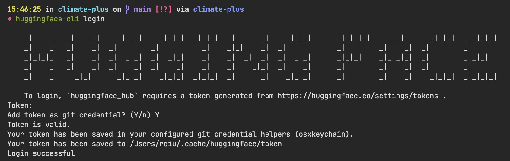

# 2.3 Transforming existing data into transformer-compatible datasets

To prepare the data for training the climate-plus model, we need to transform the existing data into transformer-compatible datasets.

The first step is to acquire an access token from Hugging Face, which is used to authenticate when pushing the datasets to the Hugging Face Hub. Once the access token is acquired, the [Hugging Face Hub Client library](https://huggingface.co/docs/huggingface_hub/installation) can be used to authenticate with the token.

Using the processed data from the previous section, we can then push it to the Hugging Face, where the data is formatted and stored that can be easily loaded and used for any transformer models.

The dataset is available at [`rexarski/TCFD_disclosure`](https://huggingface.co/datasets/rexarski/TCFD_disclosure).

## Related files

- `chitchat_wip/tcfd_uploader.py`
