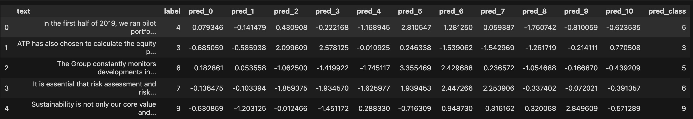

# 3.2 Downstream task 2: TCFD disclosure classification

Another task we focus on is climate-related financial disclosure (TCFD) claims. Climate-related financial disclosure is the process of providing information on the financial risks and opportunities that businesses face as a result of climate change. Climate-related financial disclosure is becoming increasingly important as the impacts of climate change become more severe and as investors demand more information about the risks associated with their investments.

The TCFD recommends that companies disclose information in four key areas: governance, strategy, risk management, and metrics and targets. This includes information about a company's climate-related risks and opportunities, its governance structure and processes for managing climate-related risks, and its targets and metrics for reducing greenhouse gas emissions and transitioning to a low-carbon economy.

The dataset we used was provided by TCFD to highlight climate-related financial disclosures that align with one or more of the TCFD’s 4 recommended categories. Our dataset expanded these 4 categories into 11 different categories based on 11 different questions companies could face. One example of a question that could be posed regarding climate-related financial disclosures is "Does the company describe its processes for identifying and/or assessing climate-related risks?"

The collected documents already contained a label, provided by the TCFD in regards to its 11 identified categories for disclosures, two sections of Governance, three sections for Metrics and Targets, Risk Management, and Strategy each. With these labels in mind, five key sentences from each of the example disclosures were included. Each of the five created sentences shares the original label of the root document they come from.

## Data Set

The dataset contains 540 records with three variables:

1. **Question**: a string feature which provided additional detail about the TCFD category label
2. **Text**: a string feature containing the raw text of the sentence from the document
3. **Label**: a string feature which identifies the 11 TCFD categories

## Methods & Results

We defined a custom pytorch dataset class and trained the model using a Roberta Tokenizer model through hugging face. This uses the same architecture as a BERT language model. This split the dataset into 394 train, 169 validation, and 30 test samples.

The results show the accuracy is <mark>37%</mark>.

The model is accessible at [`rexarski/distilroberta-tcfd-disclosure`](https://huggingface.co/rexarski/distilroberta-tcfd-disclosure).

> ⚠️ Another model following the researchers' path is accessible at [`rexarski/distilroberta-tcfd-disclosure-5`](https://huggingface.co/rexarski/distilroberta-tcfd-disclosure-5). (81% accuracy with 5 classes, including `None` which stands for not related to climate. However, the majority of their training data is `None`, which makes the model not very effective).

## Related files

- `trainer/tcfd_trainer.ipynb`
- `trainer/tcfd_trainer2.ipynb`
- `minipackage/tcfd_classify.py`
