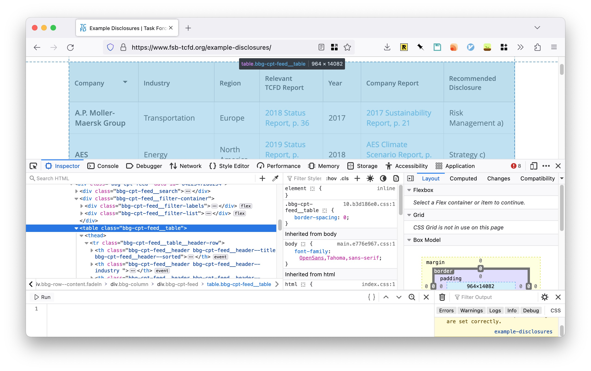
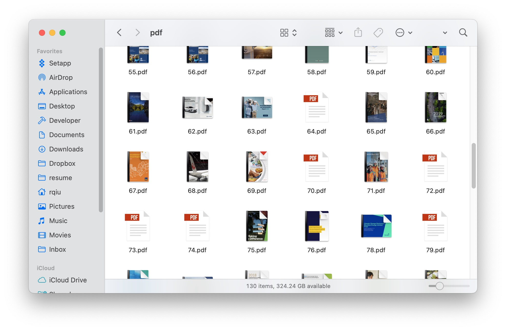

# Scraping TCFD reports

Hello and welcome to our multi-part blog post on our work-in-progress project, [climate-plus](https://github.com/rexarski/climate-plus). In this project, we are building on top of [*ClimateBERT*](https://climatebert.ai/), a transformer-based language model fine-tuned for climate-related text, to develop a tool that can classify financial disclosures according to the [*Task Force on Climate-related Financial Disclosures (TCFD)*](https://www.fsb-tcfd.org/) framework.

One of the first challenges we encountered was acquiring adequate data sources for TCFD classification. Luckily, the TCFD provides example disclosures on their website, which we decided to use as a starting point for our project. However, we quickly realized that scraping these examples was not as straightforward as we had hoped.

The table on the TCFD website that lists the example disclosures appears to render fine, but the data is actually dynamically loaded, which meant that we couldn't simply use traditional web scraping tools. Fortunately *Selenium* saved the day.

Using Selenium, we were able to scrape the TCFD website and save the example disclosures as PDF files for later text processing. However, we did encounter some roadblocks along the way. For example, some of the redirect links in the table were either invalid or in other formats, which required additional troubleshooting.

After successfully downloading the PDF files, we then parsed them into raw text (if possible), and saved them for later evidence extraction.

In the next part of this series, we will explore the feasibility of using <mark>gpt-3.5</mark> to extract top evidence from the raw text of a report, as well as the potential for hallucination originated from large language models.
